# Nova-TradingAgent

[English](README.md) · [简体中文](README.zh-CN.md) · [日本語](README.ja.md) · [한국어](README.ko.md) · [Español](README.es.md) · [Français](README.fr.md)

**Fifteen specialists. One self-hosted A-share research desk.**

The upstream TradingAgents debate graph, turned into a login-ready web desk: candlesticks, credit-metered multi-user use, optional L2 and Qlib. It does **not** place trades by default.

[](LICENSE)
[](https://github.com/rufeng0411/Nova-TradingAgent/releases)
[](https://rufeng0411.github.io/Nova-TradingAgent/)
[](https://www.python.org/downloads/)

**[Install](docs/en/install.md)** · **[User guide](docs/en/user-guide.md)** · **[Capabilities](docs/en/capabilities.md)** · **[Releases](https://github.com/rufeng0411/Nova-TradingAgent/releases)** · **[Collaborate](#collaborate)**

```bash
git clone https://github.com/rufeng0411/Nova-TradingAgent.git
cd Nova-TradingAgent
cp .env.example .env          # Windows: Copy-Item .env.example .env
# fill TA_ADMIN_PASSWORD, TA_APP_SECRET_KEY, DATABASE_URL (see .env.example Quick start)
uv sync
cd frontend && npm install && npm run build && cd ..
uv run python -m uvicorn api.main:app --host 127.0.0.1 --port 8000
```

Open `http://127.0.0.1:8000`. Health check: `GET http://127.0.0.1:8000/healthz`.

Not investment advice. Market data may be delayed.

---

## Product overview

### What it is

**Nova-TradingAgent** is a self-hosted multi-agent research workbench for China A-shares. You run FastAPI plus a built SPA on your own machine (or your own server). After login you submit a symbol; fifteen specialists split the work—research, bull/bear debate, a draft trade, risk challenge, risk verdict—and land on a structured report you can re-read, not a chat transcript that vanishes.

It keeps the original TradingAgents idea: a graph that sequences analysts, opposing researchers, a trader, and risk. This repo adds a web desk, a ChartPro K-line workstation, a two-minute fast path, a translation layer before the LLM, optional Tushare L2 order-queue, an optional Microsoft Qlib bridge, and multi-user credits / plans / admin.

This is **research and decision support**, not an execution stack. It does not talk to a broker by default.

### What you can do

- **Run a full research round:** sidebar **Smart analysis** — workflow canvas, bull/bear and risk debate drawer, decision card, report history.
- **Read the tape and get a short take:** **K-line** (ChartPro: daily/weekly/monthly, adjust, MA + Bollinger, MACD cross labels, AI chart insight). **Fast analysis** folds ~22 feature slots into one LLM pass and a conclusion card in about two minutes (off by default).
- **Feed models conclusions, not dumps:** quotes, filings, and flow are reduced to evidence before the prompt. A missing vendor degrades that slot; the job still finishes.
- **Deepen the book when you have the right:** with a Tushare L2 / order-queue entitlement, turn the flag on so analysis can cite queue pressure. Without it, that slot is empty and analysis still completes.
- **Attach quant eval when you already have Qlib data:** isolated workspace `QLIB/`, inbox/outbox file bridge. The API process must not `import qlib`. Docker does not ship Qlib.
- **Share one instance with several people:** accounts, credits, Free/Pro/Team plan requests (admin review), ledgers. `/admin` is for operators of **this** instance.
- **Leave it on overnight:** watchlist schedules on the trading-day night window, tracking board, task center, model vendor in Settings.

### Why it is different

| | Upstream TradingAgents | This repo (Nova-TradingAgent) |
| --- | --- | --- |
| Shape | Scripts / notebook, one debate graph | Login web desk (same-origin `/v1`, port **8000**) |
| Agents | Public write-ups often say 14 | **Fifteen**, including a **volume-price analyst** |
| Charting | No professional K-line desk | ChartPro + AI insight |
| Short path | None | Fast analysis (single LLM pass, off by default) |
| Data → model | Easy to dump raw tables into the prompt | **Translation layer**: conclusions + evidence |
| L2 | No product-level order-queue ingest | Tushare L2 **opt-in** |
| Quant | No isolated Qlib bridge | `QLIB/` sandbox + file queue, off by default |
| Users / ops | One local run | Multi-user credits, subscriptions, full admin |
| License | Depends on upstream snapshot | Whole tree **AGPL-3.0** |

Versus “run the graph once in a terminal”: you can **watch the debate, keep the report, meter access, and operate several accounts**. Versus “just another quote page”: the debate is reviewable, data is translated before the model, and L2/Qlib open only when **your** entitlements and local data exist.

---

## What we inherited

Upstream TradingAgents splits research into a graph: analysts write briefs → bull and bear argue → research manager closes → trader drafts → risk roles object → risk judge decides. This repo **does not drop that chain**. Default nodes:

Market · social · news · fundamentals · macro · smart money · **volume-price** · bull/bear researchers · research manager · trader · three risk voices · risk judge.

<p align="center">
  
</p>

On the web that chain is a live canvas and a debate drawer streamed by round, ending in a structured decision card—not a log that scrolls off the terminal.

<p align="center">
  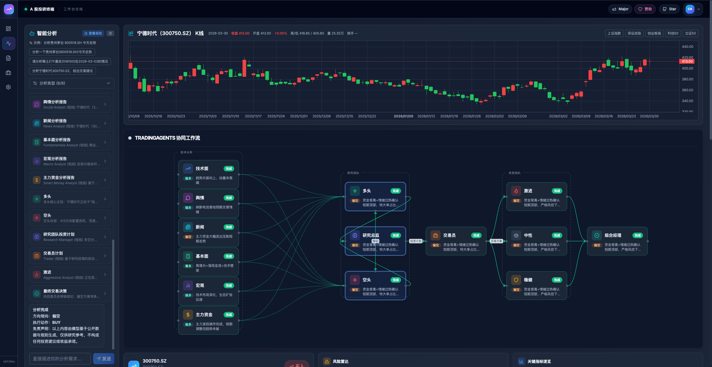
</p>

<p align="center">
  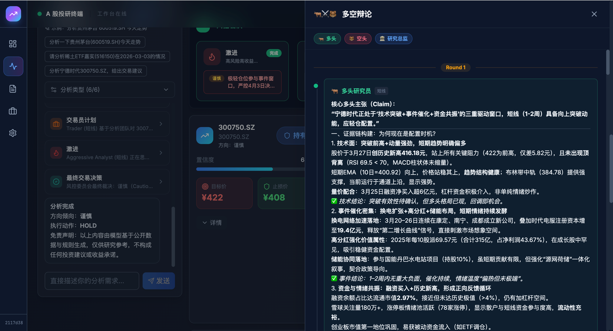
</p>

<p align="center">
  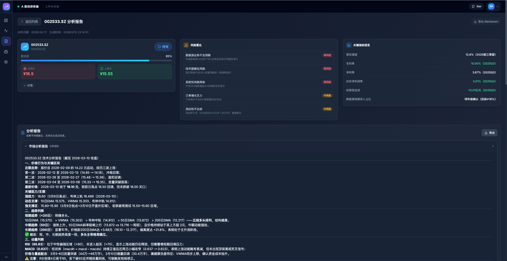
  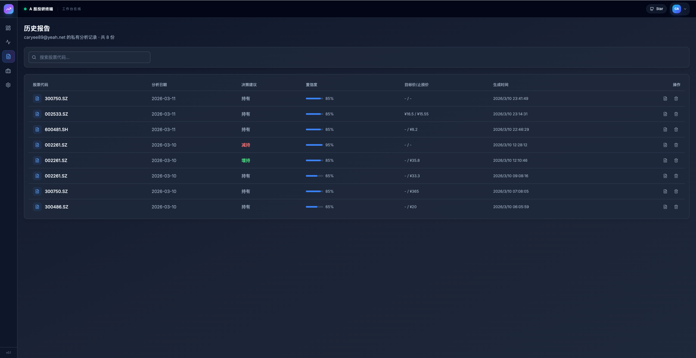
</p>

---

## What the original project does not have

These surfaces are not in the upstream script/notebook graph. K-line and fast analysis are live shots. L2 and Qlib are identified with marks—no fake empty book. Subscription and admin are live shots from this instance.

### 1. K-line workstation (ChartPro)

No professional candlestick desk upstream. Here: daily/weekly/monthly bars, adjust, MA + Bollinger, MACD golden/dead-cross labels, quote ribbon, **AI chart insight**. Time-share / five-level book are entitlement-gated. Not a broker ticket.

<p align="center">
  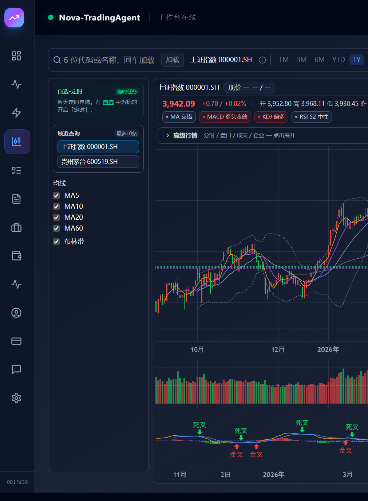
</p>

Sidebar **K-line** → `/chart`. Guide: [user-guide.md §4](docs/en/user-guide.md).

### 2. Fast analysis (~two-minute short path)

No “skip the 15-agent debate, get a card first” path upstream. Here: parallel snapshots (60-day daily bars, RT daily, auction, …) → ~22 feature slots → **one LLM pass**. Default `TA_FAST_ANALYSIS_ENABLED=0`.

<p align="center">
  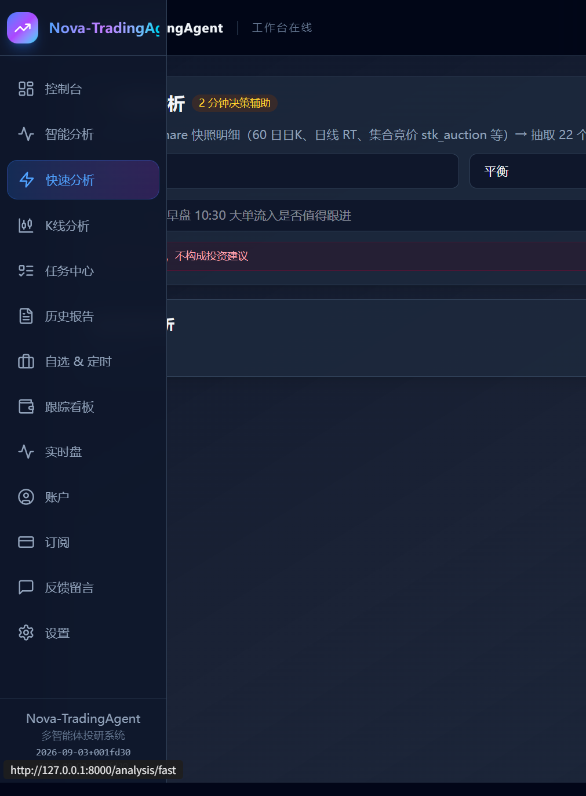
</p>

Sidebar **Fast analysis** → `/analysis/fast`. Guide: [user-guide.md §3](docs/en/user-guide.md).

### 3. L2 data ingest (Tushare order queue, opt-in)

<p align="center">
  
  &nbsp;&nbsp;&nbsp;
  
</p>

The original graph does not expose **L2 order-queue / book pressure** as a product switch. This repo wires Tushare queue-class data into the translation layer and smart-analysis vendors, so the desk can talk about hanging-order thickness and queue crowding—questions daily bars cannot answer.

It is **not** on by default:

- `.env` keeps `TA_TUSHARE_L2_ENABLED=0`. Do not enable it without a Tushare L2 / order-queue entitlement.
- If you enable it without permission, **that slot is empty or soft-fails**; smart analysis still finishes.
- To try it: `TA_TUSHARE_L2_ENABLED=1` (optional `TA_TUSHARE_L2_API`), restart the API, check the smart-analysis **data sources** dialog or advanced book on the chart.

The mark on the left is this repo’s Tushare vendor badge; the right-hand figure is a **schematic** of bid/ask queues, not a live book screenshot. An environment without L2 permission would screenshot as empty, so we do not fake one. See [configure.md](docs/en/configure.md) and [user-guide.md](docs/en/user-guide.md) “L2 order queue”.

### 4. Qlib analysis integration (isolated workspace, off by default)

<p align="center">
  
</p>

Upstream has no isolated [Microsoft Qlib](https://github.com/microsoft/qlib) eval sandbox. This repo ships a **`QLIB/` workspace**: official Qlib as a submodule or a separate clone, worker in **another Python env**. The main FastAPI process must **not** `import qlib`.

The bridge is a file queue, not training inside a web request:

1. The app writes jobs to `data/qlib_bridge/inbox/{run_id}/` (`TA_QLIB_BRIDGE_ENABLED=1`).
2. `QLIB/ta_bridge/worker.py` reads inbox in the isolated env and writes `outbox/`.
3. The app imports results for the research graph.

All `TA_QLIB_*_ENABLED` flags default to `0`. **Docker does not include Qlib** (image = API, agent package, scheduler, frontend dist). For operators who already have Qlib data locally—not a promise that clone-and-run backtests the whole market. See [QLIB/README.md](QLIB/README.md).

### 5. Multi-user subscriptions (credits, plans, ledger)

Upstream is one local run with no accounts. A self-hosted instance here can have many logins: analysis spends **credits**; users open **Subscription** for balance, Free / Pro / Team requests (admin review by default), and the credit ledger. That is ops for **your** instance, not a hosted billing SLA from this repository.

<p align="center">
  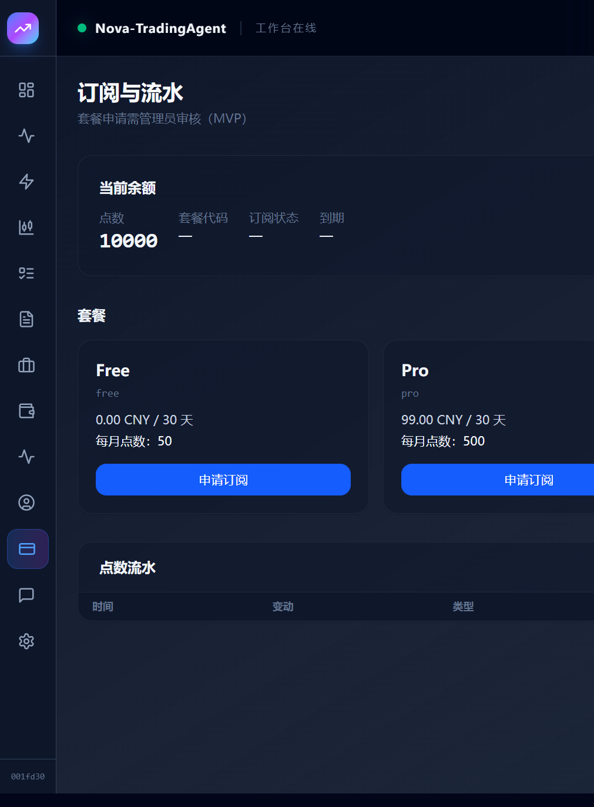
</p>

Sidebar **Subscription** → `/subscription`. Account also shows credits and plan expiry. Fresh admin has a starting balance; `TA_ALLOW_REGISTRATION=0` hides public sign-up—add users from admin.

### 6. Admin console (reports, billing, observability, audit)

No ops console upstream. Admins open `/admin` from the header. Nav groups: analysis reports, commercialization & settlement, runtime & observability, security & audit, content & brand—user/revenue/usage trends, orders and plans, credit ledger and reconciliation, API cost, tasks and LLM call logs, admin audit, user management. For the people and credits on **this** instance, not a public SaaS promise.

<p align="center">
  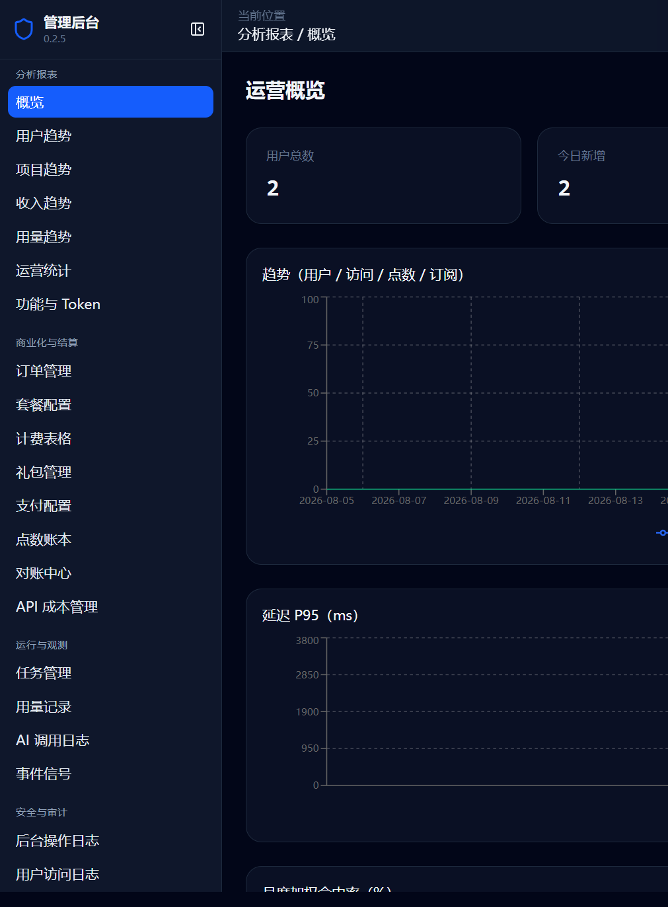
</p>

<p align="center">
  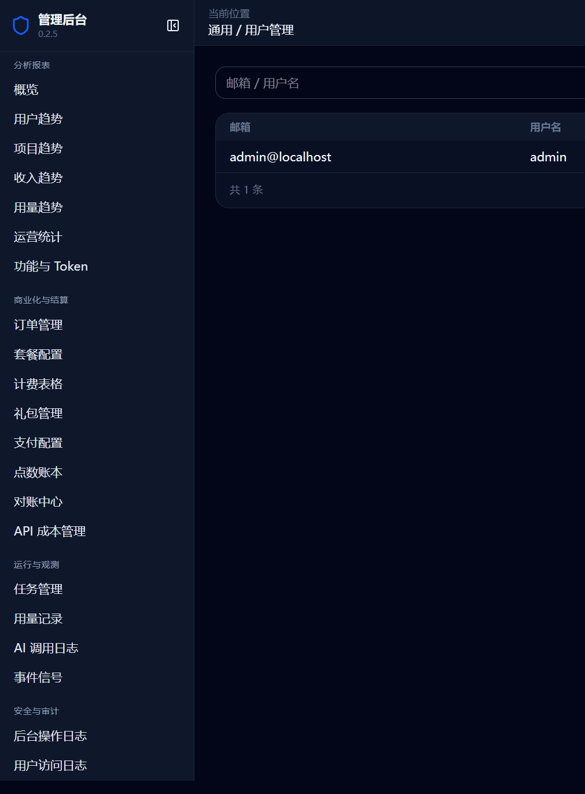
</p>

Guide: [user-guide.md §10](docs/en/user-guide.md). On a clean database the user table should be only the admin you created.

### 7. Translation layer, watchlist schedules, tracking

- **Translation layer:** models see distilled conclusions, not raw dumps. Same soft-degrade policy as L2/Qlib when a vendor is missing.
- **Watchlist & schedules:** overnight trading-day window on names you follow.
- **Tracking board, tasks, Settings:** positions, async jobs, model vendor and API key.

<p align="center">
  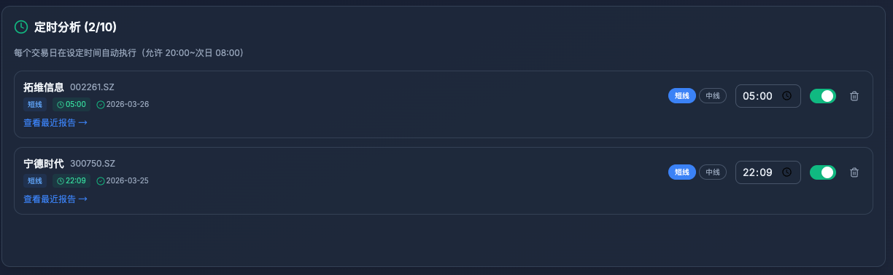
  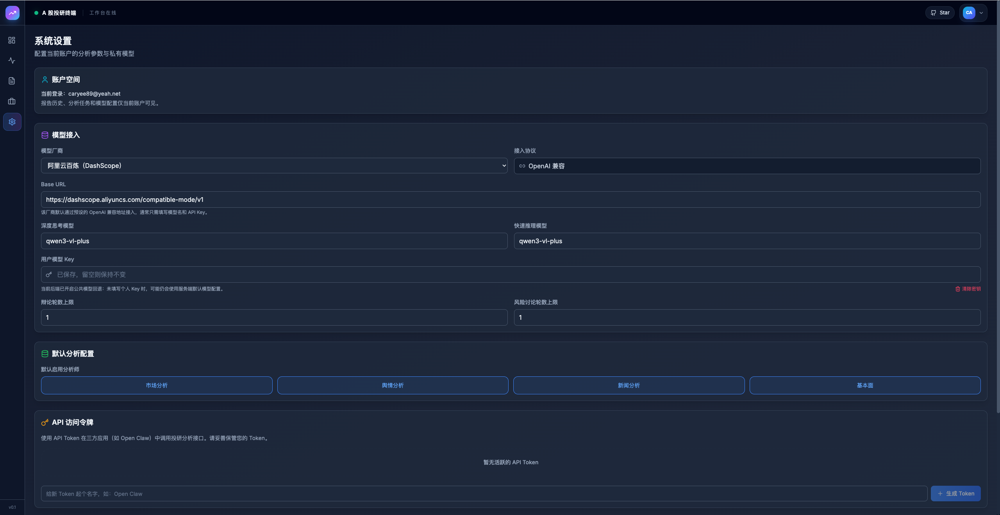
</p>

---

## Install

Follow **[docs/en/install.md](docs/en/install.md)**. Recommended: SQLite, build the frontend from source, `uvicorn` on **8000**. Electron / MySQL, Vite 5173, and API 8001 are a separate local-dev setup—do not mix them with this path. Without `frontend/dist`, the SPA will not appear.

The Docker image is published to `ghcr.io/rufeng0411/Nova-TradingAgent` when a `v*` tag is pushed. Until that build exists, `docker pull :latest` will fail; use the source install. The image does not include Qlib.

## Configure (shallow)

Required for a clean boot: admin password, `TA_APP_SECRET_KEY` (≥32 bytes), SQLite URL under `data/`. You can enter the UI without an LLM key; add `TA_API_KEY` / `TUSHARE_TOKEN` when you actually run analysis. L2, fast analysis, the Qlib bridge, and public registration default off. See **[docs/en/configure.md](docs/en/configure.md)** and the Quick start block in `.env.example`.

## Docs

- [Install](docs/en/install.md) · [安装](docs/zh-CN/install.md)
- [User guide](docs/en/user-guide.md) · [使用手册](docs/zh-CN/user-guide.md)
- [Troubleshooting](docs/en/troubleshooting.md)
- [Configure](docs/en/configure.md)
- [Capabilities](docs/en/capabilities.md)
- [FAQ](docs/en/faq.md)

## Collaborate

Community: [LINUX DO](https://linux.do).

Business and partnership: add WeChat **山君** (scan the QR).

<p align="center">
  
</p>

Issues: use GitHub templates. Do not paste API keys.

## License

GNU Affero General Public License v3.0. If you modify this software and provide it over a network, you must offer the corresponding source to your users. See [LICENSE](LICENSE), [NOTICE](NOTICE), and [THIRD_PARTY_NOTICES.md](THIRD_PARTY_NOTICES.md).

## Disclaimer

- **Not investment advice.** Output is algorithmic research, not a recommendation to buy or sell.
- **Data may be delayed or incomplete.** Exchange filings and your broker remain authoritative.
- No claim of guaranteed profit.
