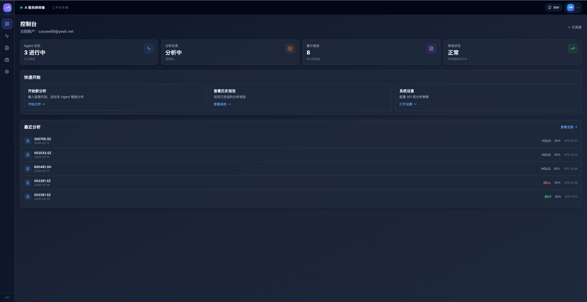

# Nova-TradingAgent

[English](README.md) · [简体中文](README.zh-CN.md) · [日本語](README.ja.md) · [한국어](README.ko.md) · [Español](README.es.md) · [Français](README.fr.md)

**十五名投研智能体，一张可自托管的 A 股研究台。**

面向 A 股的自托管多智能体投研工作台：15 名智能体辩论、可选 Tushare L2 委托队列、带 Ai 解读的 K 线分析，以及让模型读**结论**而不是原始大表的翻译层。

这是**投研工作台**，默认**不会自动下单**。

[](LICENSE)
[](https://github.com/rufeng0411/Nova-TradingAgent/releases)
[](https://www.python.org/downloads/)

**[Demo（托管实例）](https://app.510168.xyz)** · **[安装](docs/zh-CN/install.md)** · **[使用手册](docs/zh-CN/user-guide.md)** · **[Releases](https://github.com/rufeng0411/Nova-TradingAgent/releases)** · **[交流合作](#交流合作)**

Demo 是本软件的托管实例，不承诺与你的自建环境数据权限或可用性完全一致。

| 在线试用 | 自托管 | OpenClaw 技能 |
| --- | --- | --- |
| [app.510168.xyz](https://app.510168.xyz) | SQLite + `uv` + 构建后的前端，端口 **8000** | `skills/tradingagents-analysis` |

```bash
git clone https://github.com/rufeng0411/Nova-TradingAgent.git
cd Nova-TradingAgent
cp .env.example .env          # Windows: Copy-Item .env.example .env
# 填写 TA_ADMIN_PASSWORD、TA_APP_SECRET_KEY、DATABASE_URL（见 .env.example 顶部 Quick start）
uv sync
cd frontend && npm install && npm run build && cd ..
uv run python -m uvicorn api.main:app --host 127.0.0.1 --port 8000
```

浏览器打开 `http://127.0.0.1:8000`。健康检查：`GET http://127.0.0.1:8000/healthz`。

不构成投资建议。行情与财务数据可能延迟。

## 有何不同

- **15 名投研智能体** — 七名分析师（含量价）、多空辩论、研究总监、交易员、三风控与风控裁决。
- **翻译层** — 把数据源整理成模型能读的结论，而不是把原始表塞进提示词。
- **可选 Tushare L2** — 默认关闭（`TA_TUSHARE_L2_ENABLED=0`）。需要 Tushare L2 权限。无权限时相关字段为空，分析继续。
- **K 线分析** — ChartPro 主图、周期、报价与 Ai 助手（不是券商行情终端）。
- **完整自托管表面** — 登录、点数、套餐、管理后台都在本仓库。按需配置，不是「社区版砍掉计费」。

## 界面实拍

<p align="center">
  
</p>

<p align="center">
  
</p>

<p align="center">
  
  
</p>

<p align="center">
  
  
</p>

K 线 / L2 / Qlib 若打包时本机无对应权限，见评测报告说明，不用假图顶替。

## 工作台如何运转

<p align="center">
  
</p>

默认图节点：市场、情绪、新闻、基本面、宏观、主力资金、量价，加上多空研究员、研究总监、交易员、三风控与风控裁决。

## 安装

陌生人请**只按** [docs/zh-CN/install.md](docs/zh-CN/install.md) 操作。黄金路径是 SQLite + 源码构建 + **8000** 端口的 `uvicorn`。这不是维护者本机的 Electron + MySQL 开发栈（Vite **5173** / API **8001**）。

Docker 镜像随 `v*` 标签由 workflow 发布到 `ghcr.io/rufeng0411/Nova-TradingAgent`。在该构建完成前 `docker pull :latest` 会 404 — 请用源码安装。

当前 Dockerfile **不含** Qlib。

## 基本配置

干净启动必填：管理员口令、`TA_APP_SECRET_KEY`（≥32 字节）、`data/` 下的 SQLite。分析另需 `TA_API_KEY` / `TUSHARE_TOKEN`（不填也能进 UI）。详见 [docs/zh-CN/configure.md](docs/zh-CN/configure.md) 与 `.env.example` 顶部 Quick start。

## 文档

- [安装](docs/zh-CN/install.md) · [Install](docs/en/install.md)
- [使用手册](docs/zh-CN/user-guide.md)
- [故障排除](docs/zh-CN/troubleshooting.md)
- [基本配置](docs/zh-CN/configure.md)
- [能力亮点](docs/zh-CN/capabilities.md)
- [FAQ](docs/zh-CN/faq.md)

## 自托管说明（点数 / 后台）

首次启动按 `TA_ADMIN_*` 创建管理员 `admin` / `admin@localhost`。黄金路径建议 `TA_ALLOW_REGISTRATION=0`，空库只有管理员。点数、套餐与 `/admin` 面向运营本实例的人，不是对外 SaaS 承诺。

## 交流合作

商务与合作请加微信 **山君**，扫码添加（不只是报 bug）。

<p align="center">
  
</p>

Issue 请用仓库模板。不要粘贴 API Key。

## 许可

GNU Affero General Public License v3.0。若你修改本软件并通过网络向用户提供，必须向用户提供对应源码。见 [LICENSE](LICENSE)、[NOTICE](NOTICE)、[THIRD_PARTY_NOTICES.md](THIRD_PARTY_NOTICES.md)。

上游灵感：[TauricResearch/TradingAgents](https://github.com/TauricResearch/TradingAgents)（Apache-2.0）。本产品树以 AGPL-3.0 发布。

## 免责声明

- **不构成投资建议。** 输出是算法研究结果，不是买卖推荐。
- **数据可能延迟或不完整。** 请以交易所公告与你的券商为准。
- 不出现稳赚、必涨类表述。
